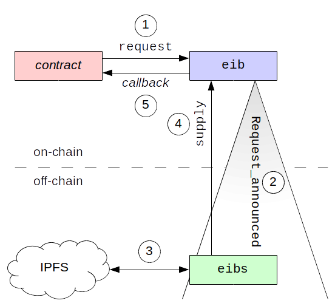

#  Ethereum Input Bus (alpha)

Samuel E. Moelius III (<sam@moeli.us>)

If EIB could be of use to your project, then please contact me (<sam@moeli.us>) and/or consider a
donation to 0xD07C0Bb4B0E5943cbeD93c337686217D91655a2e.

Contents
1. [Introduction](#user-content-introduction)
2. [Repository contents](#user-content-repository-contents)
3. [How EIB works](#user-content-how-eib-works)
4. [Building](#user-content-building)
5. [Testing](#user-content-testing)
6. [Reporting bugs](#user-content-reporting-bugs)

## Introduction

Ethereum Input Bus (EIB) provides a means for moving data onto the Ethereum blockchain securely.

More specifically, EIB allows an Ethereum contract to crowd-source a read from the InterPlanetary File
System ([IPFS](https://ipfs.io/)), and for a respondent to supply the data and prove that the data is
correct, i.e., the data comes from the correct file, the data comes from the correct offset within that
file, and the data is of the correct length.

## Repository contents

The EIB repository consists of:

  * the [EIB contract](eib/README.md) itself (receives requests, verifies responses, etc.),

  * a [prototype EIB supplier](eibs_ts/README.md) (`eibs`) implemented in TypeScript,

  * [example webapps](examples/README.md) written to use EIB, and

  * [utilities](util/README.md) for working with EIB.

## How EIB works

  * (1) A contract requests data from `eib` by calling `request`.

  * (2) `eib` emits a `Request_announced` event.

  * (3) A supplier (e.g., `eibs`) notices the event and obtains the relevant file from IPFS.

  * (4) The supplier extracts the requested data and sends it to `eib` by calling `supply`.

  * (5) `eib` verifies the data (see below) and notifies the requesting contract via a callback.

The call to `request` includes the root of a [Merkle tree](https://en.wikipedia.org/wiki/Merkle_tree)
whose leaves hold the contents of the IPFS file.  Along with the data, the supplier must send the
combined paths from the relevant leaves of this tree to its root.  In this way, the supplier *proves*
that the data is correct.  Put another way, this requirement ensures that `eib` is not fooled by a
cheating supplier who sends bogus data.

The call to `request` also includes the amount of Ether that the requestor is willing to pay for the
read.  The supplier uses some fraction of this Ether to pay for the gas needed to verify the Merkle
proof and for the requestor's callback.  The supplier keeps the remaining fraction as profit.  `eib`
does **not** keep any fraction of this Ether for itself.

A requestor can cancel its request at any time before the data has been supplied.

## Building

One should be able to build EIB by simply typing `make`.

Note that running the [examples](examples/README.md) also requires that
[Ganache](https://truffleframework.com/ganache) and [MetaMask](https://metamask.io/) be installed.
However, Ganache and MetaMask are not required to build the examples.

## Testing

EIB can be tested in two ways:

  * with the testing framework itself responding to requests (useful for testing the EIB contract
    itself) or

  * with `eibs` responding to requests (useful for testing `eibs`).

Details are given in the EIB contract's [README](eib/README.md) and in `eibs`'
[README](eibs_ts/README.md), respectively.

## Reporting bugs

Please send bug reports to Samuel E. Moelius III (sam@moeli.us).

